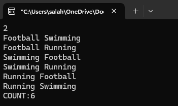

# Activity Schedules

## Problem Statement
Given a number of days `n` (1 ≤ n ≤ 10), print all possible sequences of daily activities using the set:
{"Swimming", "Running", "Football"}  
subject to the constraint that no two consecutive days have the same activity.

## Example Run (n = 2)
 

```python
Input
2
Output
Football Swimming
Football Running
Swimming Football
Swimming Running
Running Football
Running Swimming
```

```pythonfrom itertools import product
COUNT: 6
```


Expected Count Formula:

Total valid schedules = ```3 × 2^(n-1)```

Example:
```
For n=2 → 3 × 2^(1) = 6

For n=3 → 3 × 2^(2) = 12
```


_Author: Salah Dawabsheh_


